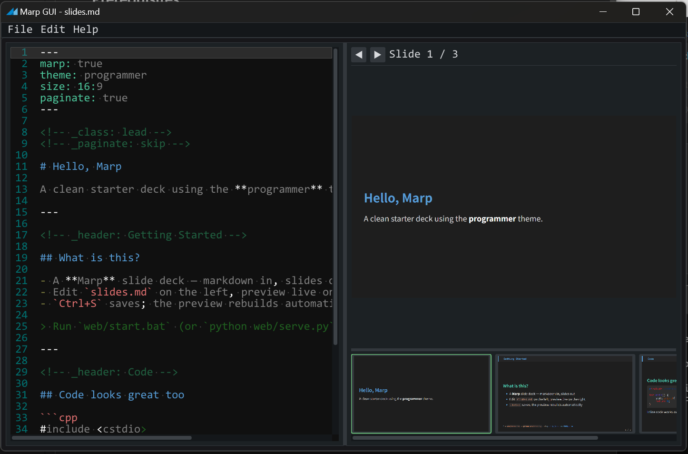

# marp-gui

Native [Marp](https://marp.app) slide editor for Windows and macOS, with live preview.



## Requirements

Node.js/npm, CMake ≥ 3.24, Chrome or Edge, and a C++17 compiler
(MSVC on Windows; Xcode Command Line Tools on macOS).

## Build and run

Use the same commands on either platform:

```sh
npm install --no-save --package-lock=false @marp-team/marp-cli
cmake -S gui -B gui/build -DCMAKE_BUILD_TYPE=Release
cmake --build gui/build --config Release --parallel
cmake --build gui/build --config Release --target run
ctest --test-dir gui/build -C Release --output-on-failure
cmake --install gui/build --config Release
```

CMake fetches the C++ dependencies. `run` opens `slides.md`; use File → Open
for another deck. Tests need an interactive desktop and the browser.
Install creates `gui/build/dist/marp-gui-{macos,windows}.zip`, containing
the `.app` or just the `.exe`. Node/Marp and the browser remain required.

Use **Cmd** on macOS or **Ctrl** on Windows: **S** saves, **O** opens,
**P** opens commands, **Z** undoes, and **Shift+Z** redoes.
File → Export produces PDF, PPTX, or HTML beside the deck.

File → Open Recent and the command palette show the five most recently
opened decks. The list persists across restarts; **Clear Recent** clears it.
Turn off **Settings → Save recent file list** to clear the list and stop
recording file history. This preference persists across restarts.
Hold **Up** or **Down** in the command palette to move through results.

**Tab** inserts spaces to the next four-column tab stop by default. Disable
**Settings → Use spaces for tabs** to insert literal tabs. **Shift+Tab**
unindents the current line or selected lines; **Shift+Backspace** and
**Ctrl+Backspace** delete the preceding word.

## Thanks

[Dear ImGui](https://github.com/ocornut/imgui),
[Test Engine](https://github.com/ocornut/imgui_test_engine),
[Marp CLI](https://github.com/marp-team/marp-cli), and
[TheAncientOwl’s themes](https://github.com/ocornut/imgui/issues/707).
Claude Code + Kimi K3.
